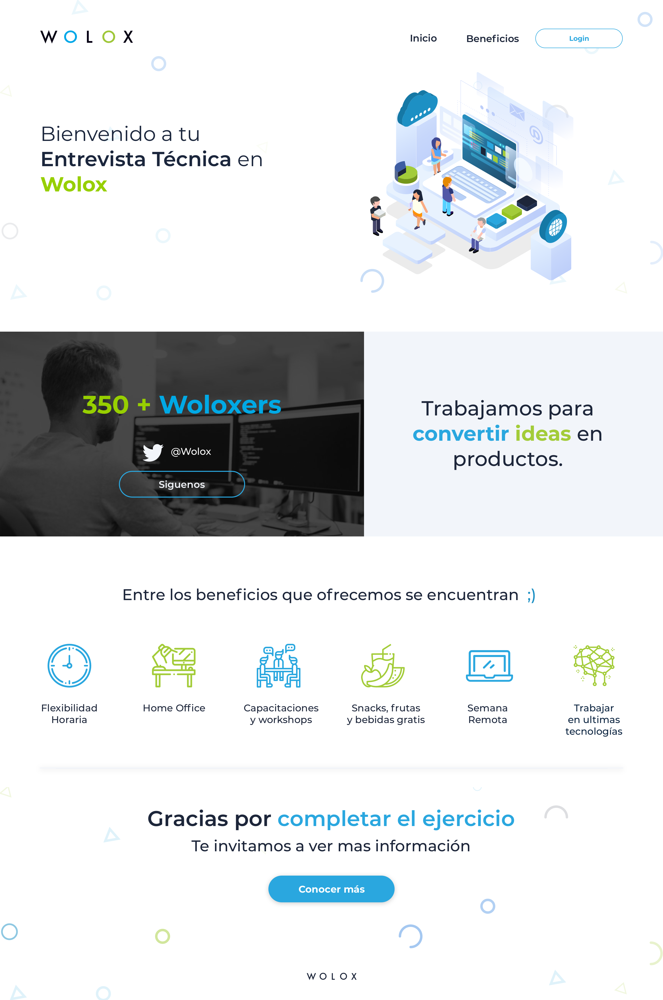

# WOLOX LANDING CHALLENGE

## Technical Test of Wolox Based  on this design

----------

### Technologies Used

- React
- Redux & Redux Thunk
- SCSS & SCSS modules
- i18n
- React Testing Library & Jest

### Deployed On

* [Vercel](https://wlx-landing.vercel.app)

----------

### Test Commmands

* Test: `yarn test`
* Coverage: `yarn test:coverage`

----------

> Design 

